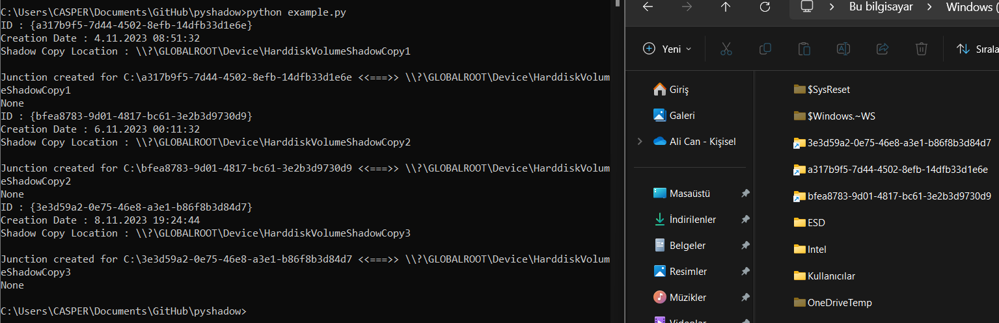

#### Python ShadowCopy Analyzer for Cyber Security Researchers!

### What is the ShadowCopy

ShadowCopy is a technology that allows you to create backup snapshots or copies of computer volumes or files, even if they are in use. It is also known as Volume Shadow Copy Service, Volume Snapshot Service or VSS. You can use ShadowCopy to restore lost files, recover from ransomware or cryptolocker attacks, or revert your system to a previous state using a system restore point.

### Medium Link for Developers
<a href="https://alicann.medium.com/pyshadow-shadowcopy-editor-50357b055c4b">Click here</a>

### Abilities
<ul>
<li> Create Pipe / Symlinks to ShadowCopies</li>
<li> List all ShadowCopies</li>
<li> Create ShadowCopy</li>
<li> Delete ShadowCopy</li>
</ul>

### Working On
<ul>
<li> Export ShadowCopy</li>
<li> List all ShadowCopies</li>
<li> Create ShadowCopy</li>
<li> Delete ShadowCopy</li>
</ul>

### Installation

PyPi : <a href="https://pypi.org/project/reshadow/">PyShadowCopy</a>

### Example Code
<pre>
# List all ShadowCopy
'''
Example Result
ID : {e9a894be-dae7-49cb-9196-b5a22148210b}
Creation Date : 6.11.2022 19:58:20
Shadow Copy Location : \\?\GLOBALROOT\Device\HarddiskVolumeShadowCopy7
'''
list = ReShadowCode.VSS_ListShadows()
for shadowlist in list:
    print("ID : " + shadowlist["id"] + "\nCreation Date : " + shadowlist["creation_time"] + "\nShadow Copy Location : " + shadowlist["shadowcopy"] + "\n")
#Create a ShadowCopy
ReShadowCode.VSS_Create()
#Create a pipe/symlink with ShadowCopy() (Ex. \\?\GLOBALROOT\Device\HarddiskVolumeShadowCopy<b>id</b>)
ReShadowCode.VSS_Create_Pipe("C:\\Shadow1", "id")
#Get file list from ShadowCopy
'''
Example Result
Ali
Ali Can Gönüllü
Ali_000_vcRuntimeMinimum_x64.log
Ali_000_vcRuntimeMinimum_x86.log
Ali_001_vcRuntimeAdditional_x64.log
Ali_001_vcRuntimeAdditional_x86.log
All Users
Default
Default User
desktop.ini
Public
TEMP
'''
list = ReShadowCode.VSS_Get_FileList("C:\\Shadow1\\Users")
for files in list:
    print(files)
</pre>

### Images

