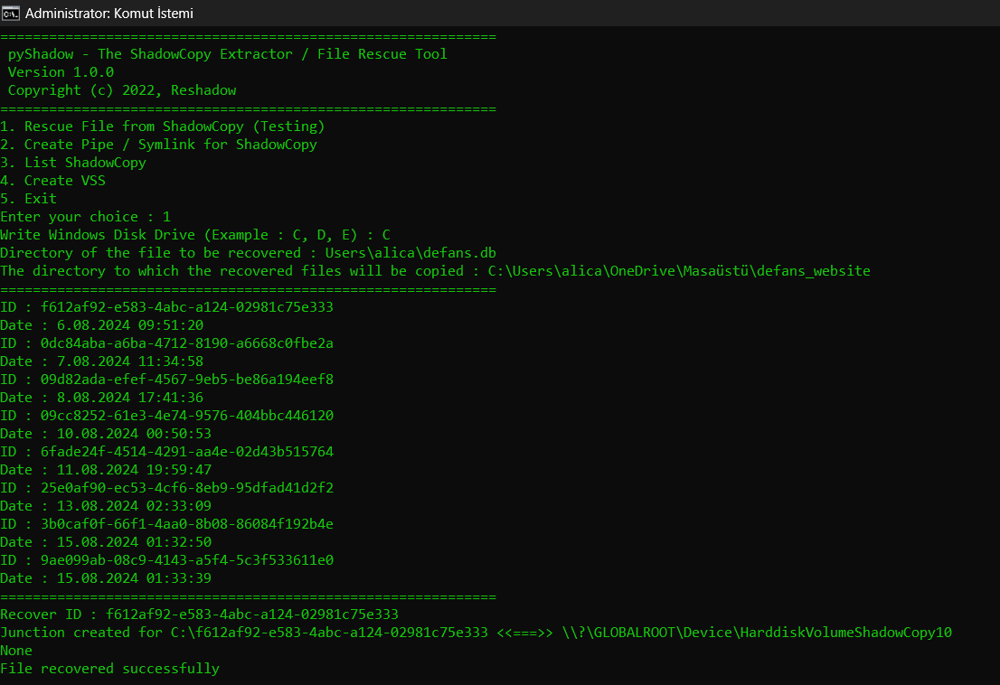

# PyShadow — Python ShadowCopy Analyzer for Forensic and Data Rescue 🛡️

**PyShadow** is a powerful Windows-only Python toolkit designed for cybersecurity researchers and forensic analysts. It interacts with Microsoft Volume Shadow Copy Service (VSS) to list, create, mount, and extract files from Shadow Copies—ideal for incident response, ransomware recovery, and forensic investigations.



> ⚠️ **Disclaimer:** For educational and lawful use only. Do not use on systems without authorization.

## 🚀 Features

* **List all Shadow Copies** on the local system.
* **Create new Shadow Copies** programmatically.
* **Mount Shadow Copies** using named pipes or symlinks.
* **Retrieve directory contents** from within a ShadowCopy.
* **Recover files** by copying them to a specified destination.
* **Delete symlinks** safely to clean up artifacts.
* **(Work in progress)** Export entire Shadow Copies to VHD format.

## 📦 Installation

Install via PyPI:

```bash
pip install pyshadow
```

Or clone the repo and install:

```bash
git clone https://github.com/alicangnll/pyshadow
cd pyshadow
pip install -r requirements.txt
python setup.py install
```

---

## 🧩 Usage Examples

### List Shadow Copies

```python
from src.reshadow import ReShadowCode

shadows = ReShadowCode.VSS_ListShadows()
for s in shadows:
    print(f"ID: {s['id']}\nCreated: {s['creation_time']}\nLocation: {s['shadowcopy']}\n")
```

### Create a Shadow Copy

```python
from src.reshadow import ReShadowCode

ReShadowCode.VSS_Create()
```

### Mount a Shadow Copy

```python
ReShadowCode.VSS_Create_Pipe("C:\\ShadowMount", "<shadow-copy-id>")
```

### Retrieve a File List

```python
files = ReShadowCode.VSS_Get_FileList("C:\\ShadowMount\\Users")
for f in files:
    print(f)
```

### Recover a Specific File

1. Mount the Shadow Copy as above.
2. Use:

   ```python
   ReShadowCode.VSS_CopyFile("C:\\ShadowMount\\path\\to\\file.txt", "C:\\Recovery\\file.txt")
   ```
3. Unmount:

   ```python
   ReShadowCode.VSS_RemoveSymlink("C:\\ShadowMount")
   ```

---

## 🛠️ Example Script (example.py)

The included `example.py` provides a CLI to:

* List ShadowCopies.
* Create symlinks for browsing.
* Recover files interactively.

Launch it via:

```bash
python example.py
```

---

## 🛡️ Requirements

* Windows OS (must support VSS)
* Python 3.6+
* Administrator (elevated CMD) to enable/modify VSS
* Dependencies listed in `requirements.txt`

---

## 🧪 Release History

* **v0.0.22 (Aug 15, 2024)** – Improved error handling (“Rescue file” fix) and added Windows executable in package ([github.com][1], [github.com][2], [github.com][3], [github.com][4], [pypi.org][5]).

---

## 📄 License

Licensed under the **GPL‑3.0** license ([github.com][2]).

---

## 🔗 About the Author

Created by **Ali Can Gönüllü** (@alicangnll), a cybersecurity researcher with expertise in penetration testing, malware analysis, and VSS tooling ([github.com][6]).

---

## 🧑‍💻 Contribution & Support

* Contributions and bug reports are welcome — feel free to open issues or PRs!
* If you'd like to support via donations or sponsorships, details are available on the author's GitHub profile.

---

## ⚠️ Usage Warning

* Requires elevated privileges to run VSS operations.
* Always ensure you're compliant with local laws and organizational policies when using tools that access system-level snapshots.

---

**Explore, analyze, and recover data safely with PyShadow!**

---

Let me know if you'd like to add badges (e.g. for PyPI, license, version), GitHub Actions CI, or a quick-start guide.

[1]: https://github.com/alicangnll/pyshadow/releases "Releases · alicangnll/pyshadow - GitHub"
[2]: https://github.com/alicangnll/pyshadow "GitHub - alicangnll/pyshadow: Python ShadowCopy Analyzer for Cyber ..."
[3]: https://github.com/alicangnll/pyshadow/blob/main/example.py "pyshadow/example.py at main · alicangnll/pyshadow - GitHub"
[4]: https://github.com/topics/file-recovery?l=python "file-recovery · GitHub Topics · GitHub"
[5]: https://pypi.org/project/pyshadow/ "pyshadow · PyPI"
[6]: https://github.com/alicangnll "alicangnll (Ali Can Gönüllü) - GitHub"
